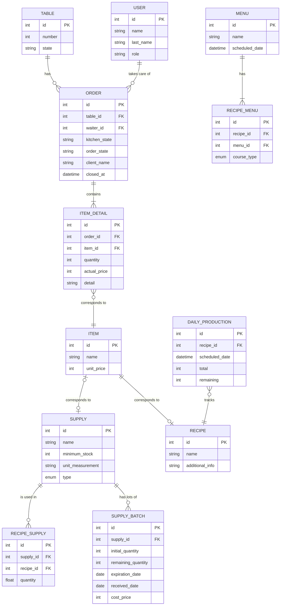

# Arquitectura del Sistema

## 1. Diagrama de Contexto

Este diagrama representa la vista de alto nivel del sistema. Se enfoca en las interacciones entre los actores y el sistema.

### Actores y Responsabilidades

- **Sistema Restaurante:** El núcleo digital que centraliza la operación.
- **Garzón:**
  - Ingresa comandas y cierra cuentas.
  - Consulta el estado de los platos (para informar tiempos al cliente) y la disponibilidad de comida.
- **Cocina:**
  - Visualiza comandas en orden de llegada.
  - Marca el inicio de preparación y entrega de platos.
  - Define la disponibilidad de las comidas del día (se descuentan automáticamente los insumos del inventario).
- **Administrador:**
  - Define el catálogo maestro (Recetas) y planifica el menú semanal/diario.
  - Gestiona el inventario de insumos (compras).
  - Visualiza reportes de ventas y rendimiento.

## 2. Modelo de Datos

Este diagrama define la estructura de la base de datos y las relaciones entre entidades.

