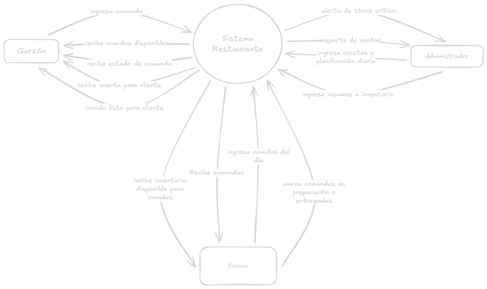
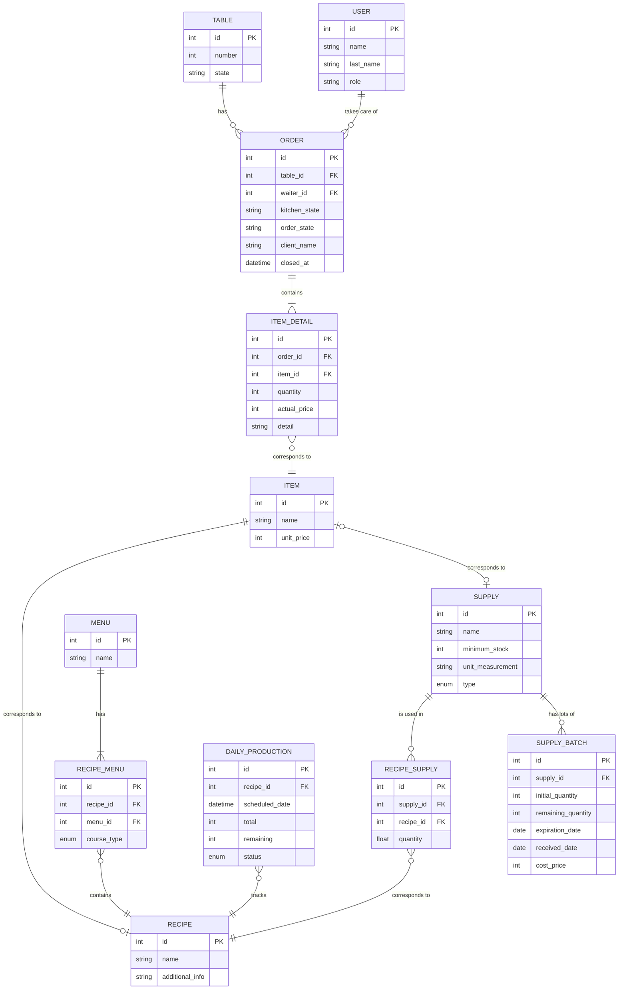
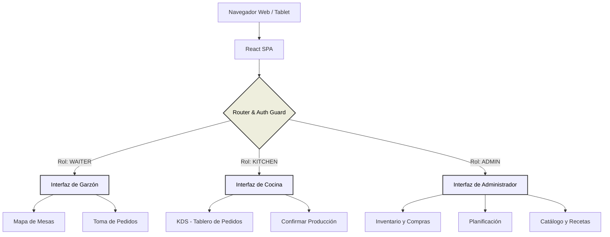

# Arquitectura del Sistema

## 1. Diagrama de Contexto

Este diagrama representa la vista de alto nivel del sistema. Se enfoca en las interacciones entre los actores y el sistema.

### Actores y Responsabilidades

- **Sistema Restaurante:** El núcleo digital que centraliza la operación.
- **Garzón:**
  - Ingresa comandas y cierra cuentas.
  - Consulta el estado de los platos (para informar tiempos al cliente) y la disponibilidad de comida.
- **Cocina:**
  - Visualiza comandas en orden de llegada.
  - Marca el inicio de preparación y entrega de platos.
  - Define la disponibilidad de las comidas del día (se descuentan automáticamente los insumos del inventario).
- **Administrador:**
  - Define el catálogo maestro (Recetas) y planifica el menú semanal/diario.
  - Gestiona el inventario de insumos (compras).
  - Visualiza reportes de ventas y rendimiento.

## 2. Modelo de Datos

Este diagrama define la estructura de la base de datos y las relaciones entre entidades.

```mermaid

erDiagram
%% Esto es un comentario: Define la relación
TABLE ||--o{ ORDER : "has"
ORDER ||--|{ ITEM_DETAIL: "contains"
RECIPE_MENU }o--|| RECIPE : "contains"
SUPPLY ||--o{ RECIPE_SUPPLY : "is used in"
RECIPE_SUPPLY }o--|| RECIPE: "corresponds to"
ITEM_DETAIL }o--|| ITEM: "corresponds to "
ITEM ||--o| RECIPE: "corresponds to"
ITEM |o--o| SUPPLY : "corresponds to"
USER ||--o{ ORDER: "takes care of"
MENU ||--|{ RECIPE_MENU : "has"
DAILY_PRODUCTION }o--|| RECIPE : "tracks"
SUPPLY ||--o{ SUPPLY_BATCH:"has lots of"


    USER {
      int id PK
      string name
      string last_name
      string role

    }

    TABLE {
        int id PK
        int number
        string state
    }

    ORDER {
        int id PK
        int table_id FK
        int waiter_id FK
        string kitchen_state
        string order_state
        string client_name
        datetime closed_at
    }

    ITEM {
      int id PK
      string name
      int unit_price
    }

    ITEM_DETAIL {
      int id PK
      int order_id FK
      int item_id FK
      int quantity
      int actual_price
      string detail
    }


    RECIPE {
      int id PK
      string name
      string additional_info

    }

    RECIPE_SUPPLY {
      int id PK
      int supply_id FK
      int recipe_id FK
      float quantity
    }

    SUPPLY {
      int id PK
      string name
      int minimum_stock
      string unit_measurement
      enum type
    }

    SUPPLY_BATCH {
      int id PK
      int supply_id FK
      int initial_quantity
      int remaining_quantity
      date expiration_date
      date received_date
      int cost_price
    }

    MENU {
      int id PK
      string name
    }

    RECIPE_MENU {
      int id PK
      int recipe_id FK
      int menu_id FK
      enum course_type

    }

    DAILY_PRODUCTION {
      int id PK
      int recipe_id FK
      datetime scheduled_date
      int total
      int remaining
      enum status
    }


```

## 3. Estilo de Arquitectura (Backend)

El sistema central se trata de una arquitectura monolítica modular. Aunque es una única aplicación desplegada, internamente sus responsabilidades están separadas por dominios de negocio.

- Arquitectura de Capas (Layered Architecture): Cada módulo divide su lógica en Controladores, Servicios y Repositorios.
- Domain-Driven Desing (DDD): Si bien no se trata de una implementación estricta del enfoque DDD, la lógica del negocio dicta las operaciones técnicas, evitando la manipulación directa de la base de datos sin contexto de negocio.

## 4. Arquitectura Frontend

Para optimizar el desarrollo y el mantenimiento, el cliente web se consturye como una única SPA (Single Page Application). Sin embargo, existen tres distintas experiencias de usuario, que se gestionan internamente mediante enrutamiento basado en roles (Role-Based Access Control - RBAC).

```mermaid
graph TD
    %% Definición de nodos
    Cliente[Navegador Web / Tablet]
    SPA[React SPA]
    Router{Router & Auth Guard}

    %% Interfaces de Usuario (Workspaces)
    UI_Garzon[Interfaz de Garzón]
    UI_Cocina[Interfaz de Cocina]
    UI_Admin[Interfaz de Administrador]

    %% Flujos de UI
    UI_Garzon_Mesas[Mapa de Mesas]
    UI_Garzon_Comandas[Toma de Pedidos]

    UI_Cocina_KDS[KDS - Tablero de Pedidos]
    UI_Cocina_Prod[Confirmar Producción]

    UI_Admin_Inv[Inventario y Compras]
    UI_Admin_Plan[Planificación]
    UI_Admin_Cat[Catálogo y Recetas]

    %% Conexiones
    Cliente --> SPA
    SPA --> Router

    %% Ruteo principal por Rol (Líneas sólidas)
    Router -- "Rol: WAITER" --> UI_Garzon
    Router -- "Rol: KITCHEN" --> UI_Cocina
    Router -- "Rol: ADMIN" --> UI_Admin


    %% Desglose Garzón
    UI_Garzon --> UI_Garzon_Mesas
    UI_Garzon --> UI_Garzon_Comandas

    %% Desglose Cocina
    UI_Cocina --> UI_Cocina_KDS
    UI_Cocina --> UI_Cocina_Prod

    %% Desglose Admin
    UI_Admin --> UI_Admin_Inv
    UI_Admin --> UI_Admin_Plan
    UI_Admin --> UI_Admin_Cat

    %% Estilos
    classDef auth fill:#eed,stroke:#333,stroke-width:2px,color:#000;
    classDef interface fill:#eef,stroke:#333,stroke-width:2px,color:#000;
    class Router auth;
    class UI_Garzon,UI_Cocina,UI_Admin interface;
```

### Gestión de Vistas por Rol

#### 1. **Interfaz de Garzón**

- **Enfoque UX** : Alta velocidad, botones grandes para uso en pantallas táctiles (tablets o smartphones).
- **Alcance** : Lectura de catálogo, cración/modificación de `ORDERS` e `ITEM_DETAIL`, y visualizaicón del `kitchen_state` en tiempo real. No tiene información de costos o inventario base.

#### 2. **Interfaz de Cocina**

- **Enfoque UX** : Actualizaciones en tiempo real mediante _WebSockets_, interacciones de un solo toque, alta visibilidad, (tablet o incluso visualización en pantalla grande).
- **Alcance**: Visualización de la cola de pedidos, actualización de estados de cocina y ejecución de la `DAILY_PRODUCTION` (cambio de estado).

#### 3. **Interfaz de Administrador**

- **Enfoque UX**: Claridad, control y visión global. Interfaces limpias y estructuradas para tomar decisiones de negocio rápidamente sin abrumar al usuario.
- **Alcance**: Acceso total. Gestión de inventario (`SUPPLY`), definición del catálogo maestro (`RECIPE`), planificación de la producción diaria/semanal (`DAILY_PRODUCTION`), revisión de métricas y reportes.
